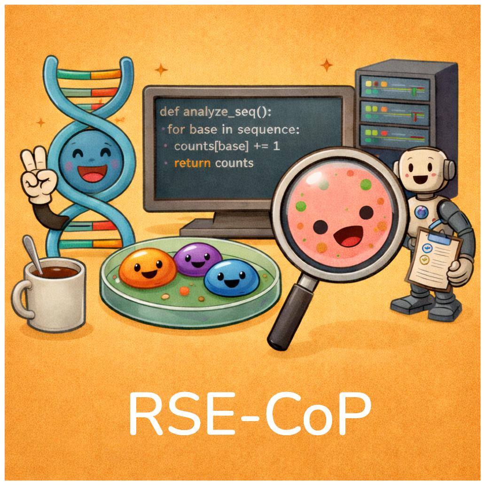

# Research Software Engineering  Community of Practice (RSE-CoP)

 

A local Research Software Engineering Community of Practice (RSE-CoP) hosted by the Department of Biomedical Informatics within the School of Medicine at CU Anschutz.

We host periodic lightning talks, discussions, and collaborative sessions focused on scientific software, data workflows, and research computing practices.

<strong>🎉 Please join us by completing this form!</strong>

<a href="https://forms.office.com/r/CyzAD84Eea">https://forms.office.com/r/CyzAD84Eea</a>
 
(<i>requires CU Anschutz login</i>)

 

Once you submit the above form you will be added to a group for email-based communications.
You also will receive an invite to our Discord server for optional async communications.
Please don't hesitate to reach out if you have any questions!

Please also note:

- We abide a [code of conduct](CODE_OF_CONDUCT.md).
- Feel free to submit changes following our (super minimal) [contributing](CONTRIBUTING.md) guide.
