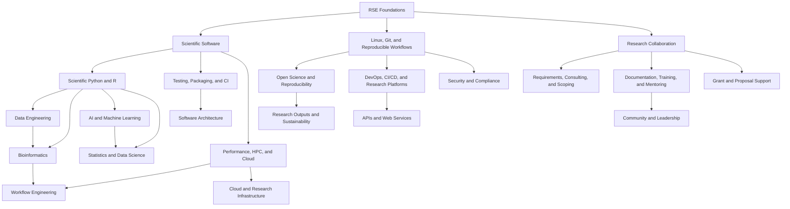
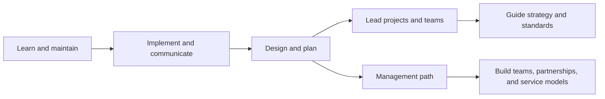
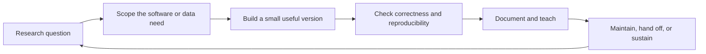

A shared vocabulary for entering, growing within, or supporting Research Software Engineering (RSE) work. Not a formal promotion rubric: a set of prompts for career conversations and self-directed learning. RSEs come from many paths: some from software engineering who grew curious about research problems, some from research who leaned into the software side of their work. Both directions are valid starting points.

**On this page:**
- 🗺️ [Landscape](#landscape)
- 📈 [Growth stages](#growth-stages)
- 🛠️ [Skill areas](#skill-areas)
- 🔬 [Specialization](#specialization)
- 📚 [Learning resources](#learning-resources-by-area)
- ✅ [Self-assessment](#self-assessment-prompts)
- 💼 [Getting a job](#preparing-for-rse-roles)
- 🔄 [Practice model](#practice-model)
- 📖 [Sources](#source-material)

---

## 🗺️ Landscape

RSE work spans a broad set of skill areas rooted in shared foundations. From those foundations, practice branches into specialized technical tracks and outward-facing collaboration work. The tracks are not siloed: a bioinformatician often relies on workflow engineering; an AI/ML RSE draws on data engineering and statistics; a community leader builds on documentation and teaching experience. Most RSEs develop depth in one or two areas while staying conversant with several others.

The US-RSE skills framework organizes RSE competencies into ten broad categories: software development, user interfaces, computer science, domain-specific topics, software operations and quality, data management, data analysis, people-related skills, research output, and community. The landscape above maps these categories onto practice areas that commonly occur together in real RSE roles.

## 📈 Growth stages

| Stage | Typical focus | Evidence of growth |
| ----- | ------------- | ------------------ |
| Foundations | Git, Linux, scripting, basic testing, documentation. | Maintains code with guidance; asks good questions. |
| Practitioner | Implements scoped software or data work; applies team practices. | Delivers features, fixes, or analyses; writes useful docs. |
| Builder | Designs research software, data pipelines, or analysis workflows. | Scopes work with researchers; improves reproducibility. |
| Lead | Coordinates projects or small teams; mentors; manages risk. | Leads multi-person work; teaches; practices reused by others. |
| Principal or Manager | Sets standards, builds partnerships, shapes service models. | Guides strategy; supports hiring; contributes to the community. |

Entry point varies. Someone with years of research and domain experience but limited software practice often starts at Practitioner level and moves quickly. Someone with strong engineering skills but little research exposure may find Foundations the right starting place for the domain side. Most people are stronger in one direction than the other.

## 🛠️ Skill areas

The table below is organized around the [US-RSE skills framework](https://us-rse.org/wg/education_training/skills/). Each row maps to one or more of the framework's ten categories. The "subcategories" column names specific skills from the framework that fall under each area.

| Area | Subcategories (US-RSE) | What "getting good" looks like | Starting points |
| ---- | ---------------------- | ------------------------------ | --------------- |
| Scientific programming | Programming, software architecture, cross-platform development, version control | Readable, documented, testable code in one or more scientific languages; packages others can install and reuse. | Python, R, Julia, or MATLAB; virtual environments; Git; NumPy/SciPy or tidyverse; packaging basics. |
| Software engineering practice | Testing, peer code review, packaging/releasing, requirements analysis, technology evaluation | Writing tests before code; reviewing others' work constructively; releasing software with changelogs and versioning. | pytest or testthat; semantic versioning; GitHub PRs and code review workflows; software design patterns. |
| HPC and cloud computing | High performance computing, distributed systems, GPU programming, scientific computing | Running jobs on a cluster or cloud; profiling bottlenecks; writing parallel code; managing costs and resource limits. | SLURM or PBS; OpenMP/MPI or Dask; Docker/Singularity; AWS/GCP/Azure fundamentals; NVIDIA CUDA basics. |
| Data engineering | Database design, query languages, data structures, data management | Building pipelines that move, validate, and store research data reliably; working with relational and document databases. | SQL; PostgreSQL or SQLite; pandas or Polars; Parquet and HDF5; workflow tools like Snakemake or Nextflow. |
| Data science and statistics | Statistical methods, data analysis, use of analysis software | Choosing appropriate statistical methods; avoiding data leakage; interpreting uncertainty; making analyses reproducible. | R (base stats, tidyverse); Python (statsmodels, scipy.stats); experimental design; Bayesian basics. |
| AI and machine learning | Artificial intelligence, machine learning, deep learning, neural networks, computer vision, information retrieval | Building reproducible training pipelines; tracking experiments; evaluating models honestly; documenting assumptions and failure modes. | scikit-learn; PyTorch or TensorFlow; MLflow or Weights & Biases; model cards; evaluation metrics. |
| Domain-specific topics | Bioinformatics, GIS, simulation, agent-based modeling, signal processing | Deep enough domain knowledge to catch scientific errors, choose correct methods, and collaborate as a peer with researchers. | Sequence analysis tools; QGIS or GeoPandas; domain workflow managers (nf-core, Galaxy); simulation frameworks. |
| DevOps and research infrastructure | CI/CD, containerization, system administration, operating, web services/API development | Automating builds, tests, and deployments; writing APIs that researchers can use; managing research software in production. | GitHub Actions; Docker and Singularity; REST API design; FastAPI or Flask; infrastructure-as-code; monitoring basics. |
| Open science and reproducibility | Open source development, interoperability, reliability, fault tolerance, software quality | Making code, data, environments, and methods reusable and citable; working in the open from the start of a project. | FAIR principles; Zenodo and OSF; software citation (CITATION.cff); environment management; The Turing Way. |
| Visualization and UX | Data visualization, UX design, graphic design, frontend development | Choosing the right chart for the question; building dashboards researchers actually use; checking for accessibility. | Matplotlib, ggplot2, Altair, or Observable Plot; accessibility guidelines (WCAG); user testing basics; Streamlit or Shiny. |
| Research collaboration and project management | Requirements gathering, project management, process development, support | Translating a research question into a scoped software task; managing timelines and stakeholder expectations. | Agile/Scrum basics; GitHub Issues and Projects; stakeholder interview techniques; scope documents. |
| Documentation and training | Documentation (developer and end-user), training, consulting, mentoring, pair programming | Writing docs that reduce support load; teaching a workshop; onboarding a new lab member; giving effective code review. | Sphinx or MkDocs; Carpentries lesson design; tutorial writing; pair programming practices. |
| Research output and communication | Presentation of results, scientific writing, software advertising, funding/grants | Writing methods sections accurately; giving conference talks; contributing to grant proposals; publicizing software effectively. | Scientific writing style guides; conference abstract writing; grant proposal structure; README best practices. |
| Community and leadership | Lobbying, networking, people management, technical leadership, software feedback gathering | Building a community of practice; representing RSEs in institutional conversations; influencing open source projects. | US-RSE working groups; open source contribution; RSE community events; mentoring programs. |

## 🔬 Specialization

Strong RSEs usually go deep in at least one scientific domain. Someone who understands RNA-seq, clinical trial data models, or imaging pipelines can catch scientific errors, suggest better methods, and earn researcher trust that generalists rarely get. Deep familiarity with how a field actually works (its data, its methods, its failure modes) is harder to hire for than software skill, and often more valuable once someone has both. Specialization doesn't replace foundations; it multiplies them.

A few patterns that work well at research institutions:

- **Domain + methods**: pair a scientific area (genomics, health AI, materials science) with a methodological strength (workflow engineering, ML, statistics).
- **Platform + domain**: pair infrastructure expertise (HPC, cloud, data pipelines) with knowledge of what a specific research community actually runs on those platforms.
- **Software + community**: become the person who knows both the tool and the people who use it: maintainer, trainer, and domain collaborator at once.

Attending domain-specific conferences and community events is one of the most direct ways to find where your skills are needed and to build the relationships that lead to interesting work. See the [conferences page](/conferences/) for a curated list.

## 📚 Learning resources by area

Free or widely accessible starting points: a first foothold, not a complete curriculum. See the full [US-RSE skills list](https://us-rse.org/wg/education_training/skills/) for a comprehensive taxonomy.

**Scientific programming**
- [Software Carpentry](https://software-carpentry.org/lessons/): Python, R, Git, and Unix shell in a research context
- [Scientific Python development guide](https://learn.scientific-python.org/development/): packaging, testing, and CI for the scientific Python ecosystem
- [The Turing Way](https://the-turing-way.netlify.app/): reproducible, ethical, collaborative research computing

**Software engineering practice**
- [The Missing Semester of Your CS Education](https://missing.csail.mit.edu/): shell, version control, debugging, and build systems from first principles
- [Software Carpentry: Git](https://swcarpentry.github.io/git-novice/): version control for researchers
- [Testing and CI chapter, The Turing Way](https://the-turing-way.netlify.app/reproducible-research/testing): testing strategies and continuous integration for research software

**HPC and cloud computing**
- [HPC Carpentry](https://www.hpc-carpentry.org/): shell, job submission, and parallel computing
- [ACCESS](https://access-ci.org/): training materials and compute allocations for US research computing
- [Docker Get Started](https://docs.docker.com/get-started/): containerization for reproducible environments

**Data engineering**
- [Data Carpentry](https://datacarpentry.org/lessons/): data organization, SQL, tabular and genomic data
- [Frictionless Data](https://frictionlessdata.io/): data packaging, validation, and portability for research datasets
- [Snakemake tutorial](https://snakemake.readthedocs.io/en/stable/tutorial/tutorial.html): workflow management for reproducible data pipelines

**Data science and statistics**
- [StatQuest with Josh Starmer](https://www.youtube.com/@statquest): clear explanations of statistics and machine learning concepts
- [R for Data Science](https://r4ds.had.co.nz/): tidy data, visualization, modeling, and communication in R
- [Think Stats](https://greenteapress.com/wp/think-stats-2e/): statistics for programmers using Python

**AI and machine learning**
- [fast.ai Practical Deep Learning](https://course.fast.ai/): free course emphasizing experimentation and reproducibility
- [Hugging Face course](https://huggingface.co/learn): transformers, datasets, and model sharing with research focus
- [ML Test Score (Breck et al.)](https://research.google/pubs/the-ml-test-score-a-rubric-for-ml-production-readiness-and-technical-debt-reduction/): production readiness rubric for ML systems

**Domain-specific topics (bioinformatics and beyond)**
- [Bioinformatics Workbook](https://bioinformaticsworkbook.org/): practical command-line bioinformatics for life scientists
- [nf-core](https://nf-co.re/): curated Nextflow pipelines and community training materials
- [Bioconductor course materials](https://bioconductor.org/help/course-materials/): R-based genomics and bioinformatics workflows

**DevOps and research infrastructure**
- [GitHub Actions docs](https://docs.github.com/en/actions): primary reference with starter workflows for research software
- [The Turing Way: CI chapter](https://the-turing-way.netlify.app/reproducible-research/ci): continuous integration for research
- [FastAPI tutorial](https://fastapi.tiangolo.com/tutorial/): building APIs for research software services

**Open science and reproducibility**
- [The Turing Way](https://the-turing-way.netlify.app/): the most comprehensive community resource on reproducible and open research
- [Zenodo](https://zenodo.org/) and [OSF](https://osf.io/): free archival repositories for code, data, and preprints
- [CITATION.cff guide](https://citation-file-format.github.io/): making software citable with a machine-readable citation file

**Visualization and UX**
- [Fundamentals of Data Visualization (Wilke)](https://clauswilke.com/dataviz/): principles-first, free online book
- [Observable Plot docs](https://observablehq.com/plot/): web-based exploratory and publication figures
- [WAVE](https://wave.webaim.org/): quick accessibility check for browser-based outputs

**Research collaboration and project management**
- [Agile for Research groups (Software Sustainability Institute)](https://www.software.ac.uk/): guides on applying agile practices in research software teams
- [GitHub Projects](https://docs.github.com/en/issues/planning-and-tracking-with-projects): lightweight project tracking close to the code

**Documentation and training**
- [Carpentries instructor training](https://carpentries.github.io/instructor-training/): evidence-based teaching for technical workshops
- [Diátaxis documentation framework](https://diataxis.fr/): structured approach to writing tutorials, how-to guides, references, and explanations
- [Write the Docs community](https://www.writethedocs.org/): community and guides for software documentation

**Research output and communication**
- [Ten Simple Rules for Reproducible Computational Research](https://journals.plos.org/ploscompbiol/article?id=10.1371/journal.pcbi.1003285): foundational paper on reproducible research practices
- [JOSS (Journal of Open Source Software)](https://joss.theoj.org/): peer-reviewed venue specifically for research software papers

**Community and leadership**
- [US-RSE](https://us-rse.org/): working groups, mentoring programs, and an annual conference; membership is free
- [Research Software Alliance (ReSA)](https://www.researchsoft.org/): international community tracking RSE policy and funding
- [Conferences page](/conferences/): curated list of relevant RSE and domain events

## ✅ Self-assessment prompts

Not a test: prompts for reflection or a conversation with a mentor. Use these to identify where you are strongest and where to focus next.

**Software and technical practice**

| Prompt | Foundations | Practitioner | Builder | Lead |
| ------ | ----------- | ------------ | ------- | ---- |
| Find a bug in code you didn't write? | In familiar code | In any Python/R | Across languages | By improving testability so others can too |
| Get code working again six months later? | With notes and help | With a README | With a reproducible environment | By teaching others to do the same |
| Test code before shipping it? | Occasionally | For key functions | Systematically, with CI | By setting team standards for coverage |
| Design a system others will maintain? | With guidance | For small tools | For multi-component software | As an architectural practice others apply |
| Work with HPC or cloud resources? | With help | For familiar workloads | Independently across platforms | By advising others on compute choices |

**Data and domain**

| Prompt | Foundations | Practitioner | Builder | Lead |
| ------ | ----------- | ------------ | ------- | ---- |
| Understand the science behind the data you work with? | Enough to run code | Enough to ask good questions | Enough to catch errors | Enough to shape the research direction |
| Build a data pipeline someone else can run? | For your own use | With a README | With tests and validation | As a reusable community resource |
| Choose an appropriate statistical method for a research question? | With guidance | For familiar domains | Across several domains | While coaching others on tradeoffs |
| Work with domain-specific data formats or tools? | Learning | Proficiently in one area | Across multiple domains | As a resource for the team |

**Collaboration and community**

| Prompt | Foundations | Practitioner | Builder | Lead |
| ------ | ----------- | ------------ | ------- | ---- |
| Describe your work to a researcher unfamiliar with software? | With help | Independently | Fluently | As a shared team habit |
| Say no to scope creep that would harm the project? | Rarely | With support | Confidently | While proposing a better alternative |
| Teach something RSE-related to someone else? | Informally | In a meeting or pair session | In a workshop or documentation | As a recurring community investment |
| Contribute to open source software? | Filed an issue | Submitted a patch or doc fix | Maintained a package | Stewarded a community project |
| Support a grant proposal or research funding effort? | Not yet | Contributed a methods section | Led the software plan | Shaped the research computing strategy |

## 💼 Preparing for RSE roles

Aimed at people moving into a formal RSE role from a research or engineering background.

**What hiring managers look for:**
- Evidence software improved research: used, cited, or built on by others
- Communication across the research/engineering boundary
- Maintainability habits: tests, docs, version control, reproducible environments
- Domain curiosity: willingness to learn enough science to catch bad assumptions

**Building a portfolio:**
The most useful RSE portfolio shows research impact, not polished side projects. Good pieces: a pipeline someone used in a publication, dissertation or lab code cleaned up and documented, an open-source contribution to a scientific tool, a teaching resource (tutorial notebook, lab onboarding guide), a package with a README and tests. Research experience already in hand: domain knowledge, methods, publications, collaborator relationships: counts directly; the gap to fill is usually software practice, not scientific credibility. Contributing to an existing open research tool is often faster than starting from scratch and produces a visible collaboration record.

**Common interview topics:**
Code review of unfamiliar code; scoping a vague research question into a software task; reproducibility practices; explaining a technical concept (version control, containers, tests) to a researcher.

## 🔄 Practice model

Many RSEs grow by repeating this loop across different projects, then learning to make it more reliable for other people.

## 📖 Source material

- [US-RSE: What is an RSE?](https://us-rse.org/about/what-is-an-rse/)
- [US-RSE: Skills Used by RSEs](https://us-rse.org/wg/education_training/skills/)
- [US-RSE Roles](https://us-rse.org/rse-roles/about/): collected RSE job descriptions
- [CaRCC RCD Professionalization and Facings](https://carcc.org/rcd-professionalization/facings/)
- [CaRCC Capabilities Model](https://portal.rcd-nexus.org/helpdocs/intro_and_guide)
- [CaRCC Products and Resources](https://carcc.org/products/)
- [Foundational Competencies of a Research Software Engineer](https://arxiv.org/abs/2311.11457)
- [Designing and Implementing a Comprehensive RSE Career Ladder](https://arxiv.org/abs/2602.19353)
- [Engineering Ladders](https://www.engineeringladders.com/) and [Software Engineer Leveling Matrix](https://h3h.github.io/leveling-matrix/)
- [Developer Roadmap](https://github.com/nilbuild/developer-roadmap)

  

    <button class="mermaid-overlay-close" id="mermaidOverlayClose">✕ Close</button>
    

  

